# NBA2K Editor Dependency Graph

AST-generated dependency graph for Python imports inside `nba2k_editor/`.

- Python modules scanned: 20
- Internal dependency edges: 25
- Modules with external imports: 15
- Scope: `nba2k_editor/**/*.py` only; test files and repo-root scripts are out of scope.
- Edge meaning: module A imports module B directly, based on AST `import` / `from ... import ...` statements.

## Package lanes from `__init__.py`

| Package | Declared lane |
|---|---|
| `nba2k_editor` | NBA 2K26 editor package scaffold. |
| `nba2k_editor.core` | Core utilities: configuration, logging, conversions, offsets, and extensions. |
| `nba2k_editor.entrypoints` | Executable entrypoints for the modular editor. |
| `nba2k_editor.memory` | Memory access layer (Win32 bindings and process helpers). |
| `nba2k_editor.models` | Data models for players, schemas, and roster metadata. |
| `nba2k_editor.ui` | UI layer for the Dear PyGui-based editor. |

## Internal import graph

```mermaid
flowchart LR
  nba2k_editor["nba2k_editor"]
  nba2k_editor___main__["nba2k_editor.__main__"]
  nba2k_editor_core["nba2k_editor.core"]
  nba2k_editor_core_addressing["nba2k_editor.core.addressing"]
  nba2k_editor_core_conversions["nba2k_editor.core.conversions"]
  nba2k_editor_core_field_io["nba2k_editor.core.field_io"]
  nba2k_editor_core_offsets["nba2k_editor.core.offsets"]
  nba2k_editor_entrypoints["nba2k_editor.entrypoints"]
  nba2k_editor_entrypoints_gui["nba2k_editor.entrypoints.gui"]
  nba2k_editor_entrypoints_runtime_cleanup["nba2k_editor.entrypoints.runtime_cleanup"]
  nba2k_editor_memory["nba2k_editor.memory"]
  nba2k_editor_memory_game_memory["nba2k_editor.memory.game_memory"]
  nba2k_editor_memory_win32["nba2k_editor.memory.win32"]
  nba2k_editor_models["nba2k_editor.models"]
  nba2k_editor_models_data_model["nba2k_editor.models.data_model"]
  nba2k_editor_models_schema["nba2k_editor.models.schema"]
  nba2k_editor_models_team_record_routing["nba2k_editor.models.team_record_routing"]
  nba2k_editor_ui["nba2k_editor.ui"]
  nba2k_editor_ui_dpg_editor["nba2k_editor.ui.dpg_editor"]
  nba2k_editor_ui_theme["nba2k_editor.ui.theme"]
  nba2k_editor___main__ --> nba2k_editor
  nba2k_editor___main__ --> nba2k_editor_entrypoints_gui
  nba2k_editor_core_addressing --> nba2k_editor_core_field_io
  nba2k_editor_core_field_io --> nba2k_editor_core
  nba2k_editor_core_field_io --> nba2k_editor_core_conversions
  nba2k_editor_core_field_io --> nba2k_editor_core_offsets
  nba2k_editor_core_field_io --> nba2k_editor_models_schema
  nba2k_editor_core_offsets --> nba2k_editor_core_conversions
  nba2k_editor_entrypoints_gui --> nba2k_editor_entrypoints_runtime_cleanup
  nba2k_editor_entrypoints_gui --> nba2k_editor_models_data_model
  nba2k_editor_entrypoints_gui --> nba2k_editor_ui_dpg_editor
  nba2k_editor_memory_game_memory --> nba2k_editor_memory_win32
  nba2k_editor_models_data_model --> nba2k_editor_core
  nba2k_editor_models_data_model --> nba2k_editor_core_addressing
  nba2k_editor_models_data_model --> nba2k_editor_core_conversions
  nba2k_editor_models_data_model --> nba2k_editor_core_field_io
  nba2k_editor_models_data_model --> nba2k_editor_core_offsets
  nba2k_editor_models_data_model --> nba2k_editor_memory_game_memory
  nba2k_editor_models_data_model --> nba2k_editor_models_schema
  nba2k_editor_models_team_record_routing --> nba2k_editor_models_data_model
  nba2k_editor_models_team_record_routing --> nba2k_editor_models_schema
  nba2k_editor_ui_dpg_editor --> nba2k_editor_core_conversions
  nba2k_editor_ui_dpg_editor --> nba2k_editor_models_data_model
  nba2k_editor_ui_dpg_editor --> nba2k_editor_models_team_record_routing
  nba2k_editor_ui_dpg_editor --> nba2k_editor_ui_theme
```

## Internal dependencies by module

| Module | File | Imports internal modules | Imported by |
|---|---|---|---|
| `nba2k_editor` | `__init__.py` | — | `nba2k_editor.__main__` |
| `nba2k_editor.__main__` | `__main__.py` | `nba2k_editor` `nba2k_editor.entrypoints.gui` | — |
| `nba2k_editor.core` | `core/__init__.py` | — | `nba2k_editor.core.field_io` `nba2k_editor.models.data_model` |
| `nba2k_editor.core.addressing` | `core/addressing.py` | `nba2k_editor.core.field_io` | `nba2k_editor.models.data_model` |
| `nba2k_editor.core.conversions` | `core/conversions.py` | — | `nba2k_editor.core.field_io` `nba2k_editor.core.offsets` `nba2k_editor.models.data_model` `nba2k_editor.ui.dpg_editor` |
| `nba2k_editor.core.field_io` | `core/field_io.py` | `nba2k_editor.core` `nba2k_editor.core.conversions` `nba2k_editor.core.offsets` `nba2k_editor.models.schema` | `nba2k_editor.core.addressing` `nba2k_editor.models.data_model` |
| `nba2k_editor.core.offsets` | `core/offsets.py` | `nba2k_editor.core.conversions` | `nba2k_editor.core.field_io` `nba2k_editor.models.data_model` |
| `nba2k_editor.entrypoints` | `entrypoints/__init__.py` | — | — |
| `nba2k_editor.entrypoints.gui` | `entrypoints/gui.py` | `nba2k_editor.entrypoints.runtime_cleanup` `nba2k_editor.models.data_model` `nba2k_editor.ui.dpg_editor` | `nba2k_editor.__main__` |
| `nba2k_editor.entrypoints.runtime_cleanup` | `entrypoints/runtime_cleanup.py` | — | `nba2k_editor.entrypoints.gui` |
| `nba2k_editor.memory` | `memory/__init__.py` | — | — |
| `nba2k_editor.memory.game_memory` | `memory/game_memory.py` | `nba2k_editor.memory.win32` | `nba2k_editor.models.data_model` |
| `nba2k_editor.memory.win32` | `memory/win32.py` | — | `nba2k_editor.memory.game_memory` |
| `nba2k_editor.models` | `models/__init__.py` | — | — |
| `nba2k_editor.models.data_model` | `models/data_model.py` | `nba2k_editor.core` `nba2k_editor.core.addressing` `nba2k_editor.core.conversions` `nba2k_editor.core.field_io` `nba2k_editor.core.offsets` `nba2k_editor.memory.game_memory` `nba2k_editor.models.schema` | `nba2k_editor.entrypoints.gui` `nba2k_editor.models.team_record_routing` `nba2k_editor.ui.dpg_editor` |
| `nba2k_editor.models.schema` | `models/schema.py` | — | `nba2k_editor.core.field_io` `nba2k_editor.models.data_model` `nba2k_editor.models.team_record_routing` |
| `nba2k_editor.models.team_record_routing` | `models/team_record_routing.py` | `nba2k_editor.models.data_model` `nba2k_editor.models.schema` | `nba2k_editor.ui.dpg_editor` |
| `nba2k_editor.ui` | `ui/__init__.py` | — | — |
| `nba2k_editor.ui.dpg_editor` | `ui/dpg_editor.py` | `nba2k_editor.core.conversions` `nba2k_editor.models.data_model` `nba2k_editor.models.team_record_routing` `nba2k_editor.ui.theme` | `nba2k_editor.entrypoints.gui` |
| `nba2k_editor.ui.theme` | `ui/theme.py` | — | `nba2k_editor.ui.dpg_editor` |

## External imports by module

| Module | External roots imported |
|---|---|
| `nba2k_editor` | `importlib` |
| `nba2k_editor.__main__` | `__future__` `argparse` `collections` |
| `nba2k_editor.core` | — |
| `nba2k_editor.core.addressing` | `__future__` `typing` |
| `nba2k_editor.core.conversions` | `__future__` `re` `typing` |
| `nba2k_editor.core.field_io` | `__future__` `re` `struct` `typing` |
| `nba2k_editor.core.offsets` | `__future__` `importlib` `json` `re` `typing` |
| `nba2k_editor.entrypoints` | — |
| `nba2k_editor.entrypoints.gui` | `__future__` `argparse` `collections` `json` |
| `nba2k_editor.entrypoints.runtime_cleanup` | `__future__` `os` `pathlib` `shutil` |
| `nba2k_editor.memory` | — |
| `nba2k_editor.memory.game_memory` | `__future__` `ctypes` `psutil` `struct` `sys` |
| `nba2k_editor.memory.win32` | `__future__` `ctypes` `sys` |
| `nba2k_editor.models` | — |
| `nba2k_editor.models.data_model` | `__future__` `collections` `queue` `re` `threading` `typing` |
| `nba2k_editor.models.schema` | `__future__` `dataclasses` `re` `typing` |
| `nba2k_editor.models.team_record_routing` | `__future__` `typing` |
| `nba2k_editor.ui` | — |
| `nba2k_editor.ui.dpg_editor` | `__future__` `dearpygui` `re` `typing` |
| `nba2k_editor.ui.theme` | `__future__` `dearpygui` |

## Layer-direction notes

- `ui` modules should depend on model/core contracts, not the other way around.
- `models` currently depends on `core`, `memory`, and `models.schema`; no internal module imports `ui`.
- `core` modules are imported by model/UI code and should stay free of UI dependencies.
- `memory` is imported by `models.data_model`; UI does not import memory directly.
